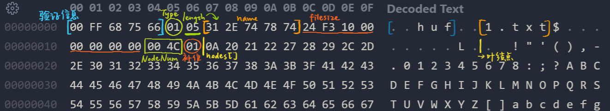
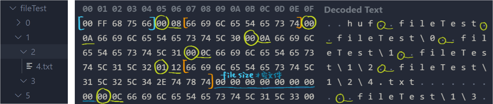

## 代码结构概要：

- 实现哈夫曼树相关操作的代码放在huffTree.h, huffTree.cpp中，由HUF.cpp生成压缩相关可执行文件，由unHUF.cpp生成解压相关可执行文件。而压缩文件预览功能则由fileTree.h, fileTree.cpp, TREE.cpp实现。
- huffTree.h中主要设计了struct huffNode和class huffTree。其中huffNode中存放每个节点对应的字符、在文件中出现的次数、左右孩子指针、待生成的哈夫曼编码，以及一些辅助优先队列生成哈夫曼树的变量和仿函数；而huffTree类则存放节点总数量、叶节点数组、分支点数组、根节点指针，以及其他相关函数（统计字符次数、生成哈夫曼树、对字符编码、压缩单个文件、解压单个文件）。同时还存放了处理文件夹的压缩解压，判断某文件是否为.huf压缩文件的函数。
- fileTree.h中主要设计了struct fileNode和class fileTree。其中fileNode中存放每个节点对应的文件名，左右孩子指针；而fileTree中存放根节点，以及创建树（所生成的文件树为左孩子右兄弟的二叉树）、添加节点、遍历打印等函数。
- 而HUF.cpp, unHUF.cpp, TREE.cpp里存放main函数，以生成对应的可执行文件，并通过命令行来交互。
 

## 设计实现思路：
### 核心需求：
1. 文件的压缩与解压 
	关于从文件的字节流中统计字符频度，由此构建哈夫曼树并存储到压缩文件中，并在解压时还原树的过程，都已经在中期文档中作了详细的阐释并附上了相关代码，故不再赘述。 
	主要变化为在压缩后头上添加了新一条信息：先在整个文件头上添加长度为5的验证信息，然后用一位来表示后面是文件还是文件夹（01为文件，00为文件夹），再用一位来表示这个文件（夹）路径的长度（查到不会超过255位，故用一位储存），后面接上完整路径。再往后用8位（long long）来存储文件大小，之后则是关于哈夫曼树、压缩后文件内容等信息的存储。 
	与此对应，解压时先验证文件头，再根据读到的第一位判断文件类型，根据第二位读出路径名称，以此创建对应目录或者文件。 
	如图所示： 
	
	对比中期： 
 	
	此外还添加了对于空文件，或只有一种字符文件的处理，并且对中期提交的代码做了一些重构，将过长的函数拆分为不同函数。 

2. 文件夹的压缩与解压 
	包含了filesystem头文件。首先判断输入的路径是否为文件夹，如果是，则通过recursive_directory_iterator递归调用子文件夹。对每个文件夹，向压缩文件中记录：第一位类型（00），第二位路径长度，后接路径。若碰到文件，第一位类型为01，后续则转到压缩文件相关函数。 
   	
	（上左为被压缩文件夹；上右为对应.huf部分内容，其打圈位为文件类型，后划线位为路径长度） 
	解压时，遇0使用create_directories函数来创建目录（可以直接创建多级目录），遇1调用解压文件的函数，通过ifstream打开对应文件作处理。 
	将每个路径名都保存的原因为：①不能丢失空文件夹的信息；②解压时，某目录下的文件需要先有该文件夹存在，才能成功创建对应文件并写入还原的信息。 
 

### 其他需求：
1. 使用CLI与用户交互 
	对HUF.cpp, unHUF.cpp, TREE.cpp中的main函数参数做处理。 
	形如：int main(int argc, char *argv[]) 
	其中argc对应命令行参数个数（调用对应exe的“./huf”算作第一个参数），argv[ ]则对应输入的每个字符串。配合_access函数判断文件（夹）是否存在，可以对不同输入和情况做出对应的提示。而对于文件重名覆盖、判断解压文件是否为huf文件等的具体实现，则放在了huffTree.cpp对应的函数中。 

2. 检验压缩包来源是否是自己的压缩工具 
 	在压缩文件头上加入长度为5的验证信息，开头为0和255，对键盘输入做一个简单的阻挡。在解压与预览时调用isHuf函数，读取这个文件头（先读入6位，再把读指针往回一位，读到的第6位（文件类型）大于1则也说明不是huf文件）。 
	仍然存在误触或伪造的可能，但是感觉过分细究意义不大，就没有做更深的处理。 

3. 文件覆盖问题 
	对压缩时命令行输入的第二个参数（压缩包名称），和解压时读取到的第一个路径，通过_access函数查找当前目录下是否有同名文件（夹）。若有则在命令行作出提示，并读取用户输入来选择覆盖还是放弃解压。 

4. 压缩包预览 
	本来想在unhuf命令里添加参数来预览，但感觉不够直观，且实现预览功能时另写了新的结构体和树，于是新建了fileTree.h, fileTree.cpp, TREE.cpp来生成preview.exe。 
	fileTree.cpp中仍有isHuf函数判断待预览的文件是否为.huf文件。加入jumpPos函数来跳过压缩内容，将读指针设置到下一段压缩文件的位置。因为压缩文件中存储路径是以“\”连接的，上网查阅得知可以通过strtok函数将路径分隔开（由a\bb\ccc得到a bb ccc），每一小段作为节点，以此来构建树、打印树。 
	一开始准备写普通的树的，但是因为子节点数量不定，导致在设置节点内容、插入节点时稍微有点无从下手，于是最后还是选择左孩子右兄弟二叉树（这在打印时很方便，只需前序遍历即可）。调整打印格式时参考了文档示例和系统树形打印方式，但是复制后显示乱码，上网查阅后发现是GBK和UTF-8的转换问题，可通过在命令行输入“chcp 65001”解决。再经过一系列微调，最后完成了形如右上图的显示。 

## 开发环境、工具：
平台：Windows；编辑器：VSCode；语言：c++；

## 编译：
压缩：`g++ HUF.cpp huffTree.cpp -o huf` 
解压：`g++ unHUF.cpp huffTree.cpp -o unhuf` 
预览：`g++ TREE.cpp fileTree.cpp -o preview` 
## 运行：
压缩：`./huf a.huf 1.txt` 
解压：`./unhuf a.huf` 
预览：`./preview a.huf`（chcp 65001） 

## 性能测试结果：
 
（一开始直接压缩了每个文件夹）
 
挑选了case2中不同的文件类型。可见对于文本类的文件压缩率较高，对于图像音频类，或原本就是压缩文件的压缩率较低。 

## 与其他压缩工具比较：
发现哈夫曼压缩整体上压缩效率并不高，而上网查阅得知这是因为压缩软件中还会利用其他的压缩算法（LZ77，deflate等）来提高压缩率。但压缩效率仍然受文件类型影响较大，而且从表格中还可以发现当子文件夹非常多时（case6），不同压缩方式的压缩效率都不高。 
压缩效率高与压缩时间短比较难同时实现。7z相比其他格式压缩率更高，但是时间则很长。 
多次反复发现电脑中其他进程的多少会对压缩时间有不小的影响（不过保持环境不变重复尝试，压缩时间也有不算小的波动）。 
